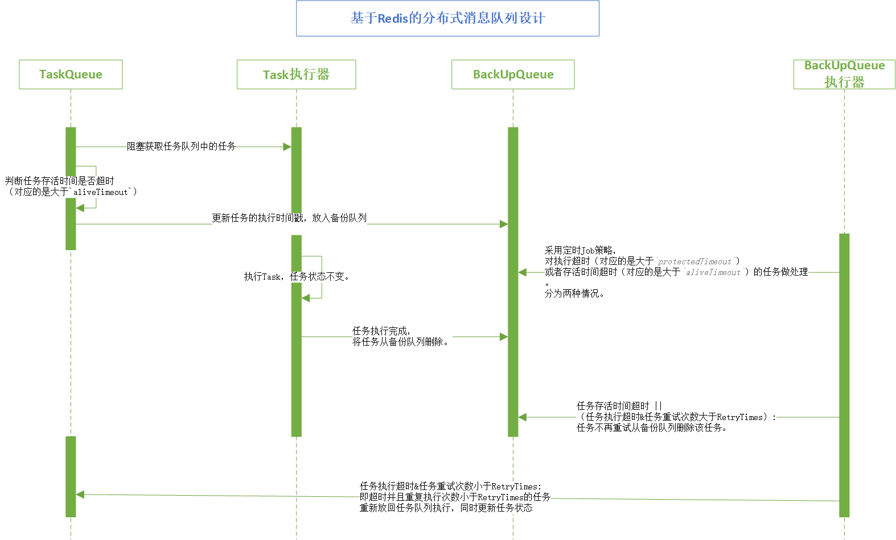

# KMQueue

[](https://travis-ci.org/fnpac/KMQueue)

该框架是基于redis实现的分布式队列，简单灵活。

下面简单介绍下该队列的一些设计，如果还有其他不懂得地方可以参考源码和注释，代码中我加入了详尽的注释。

还有其他问题可以提issue。

## 设计

### 序列图



### 队列模式

KMQueue队列分为两种模式:

- `default` - 简单队列
- `safe` - 安全队列

其中默认为`default`。

可以以`queueName:queueMode`格式设置队列的模式。

- queueName 队列名称
    
    default 为默认队列，可以不指定，默认值。
    特性：队列任务可能会丢失，队列任务没有超时限制。
           
- queueMode 队列模式，可选值有：default、safe。
    
    safe 为安全队列，任务有重试策略，达到重试次数依旧失败或者任务存活超时（这里说的超时是指AliveTimeout）（这两者都称为最终失败），Monitor会发出通知，
    这样可以根据业务做一些处理，推荐将这些失败的任务持久化到数据库作为日志记录。当然或许你还有更好的处理方式。
    
    >注意：需要开启备份队列监听程序BackupQueueMonitor，否则安全队列中最终失败的任务只会存储在备份队列中，而没有消费者去消费处理，这是很危险的行为

```java
new KMQueueManager.Builder("127.0.0.1", 6379, "worker1_queue", "worker2_queue:safe")
...
```

`worker1_queue`为简单队列，`worker2_queue`为安全队列。

>注意：为了更好的支持业务（将已存在的某个队列的`DEFAULT`改为`SAFE`，并重启服务的情况），做如下处理：
当`new KMQueueManager.Builder`的**队列名称参数**中，只要有一个队列指定了`SAFE`模式，就会创建备份队列（用于队列任务监控，设置任务超时、失败任务重试等），
并且该备份队列的名称基于传入的**所有队列名称**生成（无论其队列是否是`SAFE`模式）。

上面的例子中，备份队列的生成策略为：

```text
base64(md5("worker1_queue" + "worker2_queue"))
```

### Task（任务）

构造方法声明如下：

```java
public Task(String queue,
            String uid,
            boolean isUnique,
            String type,
            String data,
            Task.TaskStatus status)
```

- uid：如果业务需要区分队列任务的唯一性，请自行生成uid参数，
否则队列默认使用uuid生成策略，这会导致即使data数据完全相同的任务也会被当作两个不同的任务处理。

- 是否是唯一任务，即队列中同一时刻只存在一个该任务。

- type：用于业务逻辑的处理，你可以根据不同的type任务类型，调用不同的handler去处理，可以不传。

### KMQueueManager（队列管理器）

有三种方式获取Redis连接，详情查看`KMQueueManager.Builder`构造方法的三种重载形式。
如果你使用spring，建议获取spring中配置的redis连接池对象，并通过如下构造方法创建队列管理器：

```java
public Builder(Pool<Jedis> pool, String... queues)
```

### RedisTaskQueue（任务队列）

- 1.采用阻塞队列，以阻塞的方式(brpop)获取任务队列中的任务；
- 2.判断任务存活时间是否超时（对应的是大于`aliveTimeout`）；
- 3.更新任务的执行时间戳，放入备份队列的队首(lpush)；

### BackupQueueMonitor（备份队列监控）

因为初始化备份队列时设置了**循环标记**；
所以Monitor这里采用定时Job策略，使用`brpoplpush backupQueue backupQueue`循环遍历备份队列，遇到循环标记结束循环遍历。
对执行超时（对应的是大于`protectedTimeout`）或者存活时间超时（对应的是大于`aliveTimeout`）的任务做处理。

分为两种情况:

- 任务存活时间超时 || （任务执行超时&任务重试次数大于RetryTimes）：任务不再重试从备份队列删除该任务。
    相应的可以通过实现`Pipeline`，决定这些任务的一些额外处理，比如持久化到数据库做日志记录。
    ```text
    // 任务彻底失败后的处理，需要实现Pipeline接口，自行实现处理逻辑
    TaskPipeline taskPipeline = new TaskPipeline();
    BackupQueueMonitor backupQueueMonitor = new BackupQueueMonitor.Builder("127.0.0.1", 6379, backUpQueueName)
                    ...
                    .setPipeline(taskPipeline).build();
    ```
- 任务执行超时&任务重试次数小于RetryTimes：即超时并且重复执行次数小于`RetryTimes`的任务重新放回任务队列执行，同时更新任务状态：
    - 放入任务队列，优先处理(<rpush>)；
    - 任务state标记为"retry"；
    - 重试次数+1；

## 使用Demo

### 生产任务

```java
@Test
public void pushTaskTest() {
    KMQueueManager kmQueueManager = new KMQueueManager.Builder("127.0.0.1", 6379, "worker1_queue", "worker2_queue:safe")
            .setMaxWaitMillis(-1L)
            .setMaxTotal(600)
            .setMaxIdle(300)
            .setAliveTimeout(Constant.ALIVE_TIMEOUT)
            .build();
    // 初始化队列
    kmQueueManager.init();

    // 1.获取队列
    TaskQueue taskQueue = kmQueueManager.getTaskQueue("worker2_queue");
    // 2.创建任务
    JSONObject ob = new JSONObject();
    ob.put("data", "mail proxy task");
    String data = JSON.toJSONString(ob);
    // 参数 uid：如果业务需要区分队列任务的唯一性，请自行生成uid参数，
    // 否则队列默认使用uuid生成策略，这会导致即使data数据完全相同的任务也会被当作两个不同的任务处理。
    // 参数 type：用于业务逻辑的处理，你可以根据不同的type任务类型，调用不同的handler去处理，可以不传。
    Task task = new Task(taskQueue.getName(), "", true, "", data, new Task.TaskStatus());
    // 3.将任务加入队列
    taskQueue.pushTask(task);
}
```

### 消费任务

```java
@Test
public void popTaskTest() {
    KMQueueManager kmQueueManager = new KMQueueManager.Builder("127.0.0.1", 6379, "worker1_queue", "worker2_queue:safe")
            .setMaxWaitMillis(-1L)
            .setMaxTotal(600)
            .setMaxIdle(300)
            .setAliveTimeout(Constant.ALIVE_TIMEOUT)
            .build();
    // 初始化队列
    kmQueueManager.init();

    // 1.获取队列
    TaskQueue taskQueue = kmQueueManager.getTaskQueue("worker2_queue");
    // 2.获取任务
    Task task = taskQueue.popTask();
    // 业务处理放到TaskConsumersHandler里
    if (task != null) {
        task.doTask(kmQueueManager, TaskConsumersHandler.class);
    }
}
```

你可以自行实现`TaskHandler`接口，创建适合你自己业务逻辑的任务处理类，并通过下面代码执行任务处理。

```java
task.doTask(kmQueueManager, TaskHandler.class)
```

_**如果业务处理抛出异常，队列也将其当作任务执行完成处理，**

并通过`taskQueue.finishTask(this)`完成任务。

```java
public void doTask(KMQueueManager kmQueueManager, Class clazz) {

    // 获取任务所属队列
    TaskQueue taskQueue = kmQueueManager.getTaskQueue(this.getQueue());
    String queueMode = taskQueue.getMode();
    if (KMQueueManager.SAFE.equals(queueMode)) {// 安全队列
        try {
            handleTask(clazz);
        } catch (Throwable e) {
            e.printStackTrace();
        }
        // 任务执行完成，删除备份队列的相应任务
        taskQueue.finishTask(this);
    } else {// 普通队列
        handleTask(clazz);
    }
}
```

_**不会再进行任务重试操作。**_

这点可能不太容易理解，为什么任务抛出异常失败了，队列不会执行重试呢？

因为任务执行抛出异常是业务级的错误，队列不做干预。

队列的重试只是针对消费任务的线程被kill掉或者服务器宕机等情况，此时该任务还没执行完，任务的消费者还没告诉队列任务执行完成了。
此时备份队列监控会执行任务的重试。

如果你想在任务抛出异常失败时执行任务重试，可以不使用`task.doTask`，当任务抛出异常时，不执行任务的`taskQueue.finishTask(this)`操作。
这样备份队列监控会在下一个job对该任务进行检查处理。

>`taskQueue.finishTask(this)`是一个非常方便的工具方法。

### 备份队列监控

```java
@Test
public void monitorTaskTest() {

    // 任务彻底失败后的处理，需要实现Pipeline接口，自行实现处理逻辑
    TaskPipeline taskPipeline = new TaskPipeline();
    // 根据任务队列的名称构造备份队列的名称，注意：这里的任务队列参数一定要和KMQueueManager构造时传入的一一对应。
    String backUpQueueName = KMQUtils.genBackUpQueueName("worker1_queue", "worker2_queue:safe");
    // 构造Monitor监听器
    BackupQueueMonitor backupQueueMonitor = new BackupQueueMonitor.Builder("127.0.0.1", 6379, backUpQueueName)
            .setMaxWaitMillis(-1L)
            .setMaxTotal(600)
            .setMaxIdle(300)
            .setAliveTimeout(Constant.ALIVE_TIMEOUT)
            .setProtectedTimeout(Constant.PROTECTED_TIMEOUT)
            .setRetryTimes(Constant.RETRY_TIMES)
            .setPipeline(taskPipeline).build();
    // 执行监听
    backupQueueMonitor.monitor();
}
```

## 补充

重要的事情说三遍：

如果指定了队列的模式为安全队列，一定要开启**备份队列监控**！！！

如果指定了队列的模式为安全队列，一定要开启**备份队列监控**！！！

如果指定了队列的模式为安全队列，一定要开启**备份队列监控**！！！
